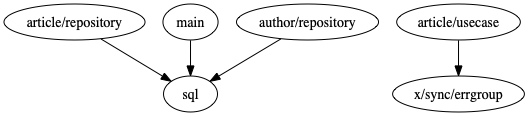

# call-graph

You can a graph of internal package relationship.

## Requirement
- [go](https://golang.org/)
- [graphviz](https://www.graphviz.org/)

## Usage
- `git clone https://github.com/st34-satoshi/call-graph`
- `go run main.go path/to/your/program/`  

if you want to select a save file name  
`go run main.go path/to/your/program/ file_name`  

### result
in the current directory  

- graph.dot
- graph.png

## Memo
- used program: [go-clean-arch](https://github.com/bxcodec/go-clean-arch)
- similar tool: [go-callvis](https://github.com/TrueFurby/go-callvis)
